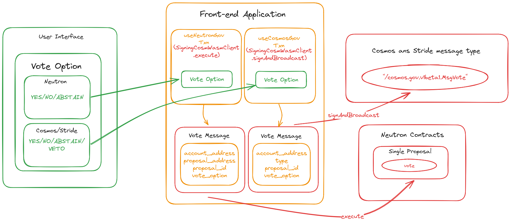

# Shared Security Interface

The shared security interface, developed by Kubik Labs, is a unified interface to view, manage and interact with the ICS aspect of all the chain opted-in. Currently there are two chains in the ICS: Neutron and Stride, along with Cosmos Hub which provides its $2.3b marjket cap to secure the consumer chains. There are 5 main pages which provide the data related to the shared-security.

- **Overview**: Provides the insights and quick stats of the chains with the graphical data.
- **Atom Economic Zone**: Provides the insights of the community. Displays upcoming community calls, consumer chains and their proposals(if any) and the assets available.
- **Governance**: All the governance proposals on Cosmos Hub and the consumer chains, seperated by appropriate tags. See details for any proposal or cast you vote.
- **Assets**: All assets of the consumer chains along with the amount.
- **Validators**: All validators validating Cosmos Hub and the consumer chains.

The General data flow of the data from the chain to the Governance Page UI is explained as an example in the diagram below.

A more specific Data Flow has been illustrated section-wise below:

## Overview

The Data Flow of the overview page showing the collection of Data from the DefiLlama API, its modification to the appropriate format and then rendering in the UI using chart.js and react-chart-js2 libraries.

## Atom Economic Zone(AEZ)

The Data Flow of the AEZ page showing the collection of Data from the Coingecko API and the contracts of the protocol, its modification to the appropriate format and then rendering in the UI.

## Governance

The Data Flow of the Governance page showing the collection of Data from the Contract and REST API, its modification to the appropriate format and then rendering in the UI.

The Data Flow of the Governance page showing the collection of Data from the UI, its modification to the appropriate format and then sending the VoteMsg by executing the transaction on the contract and Msg type URL.

